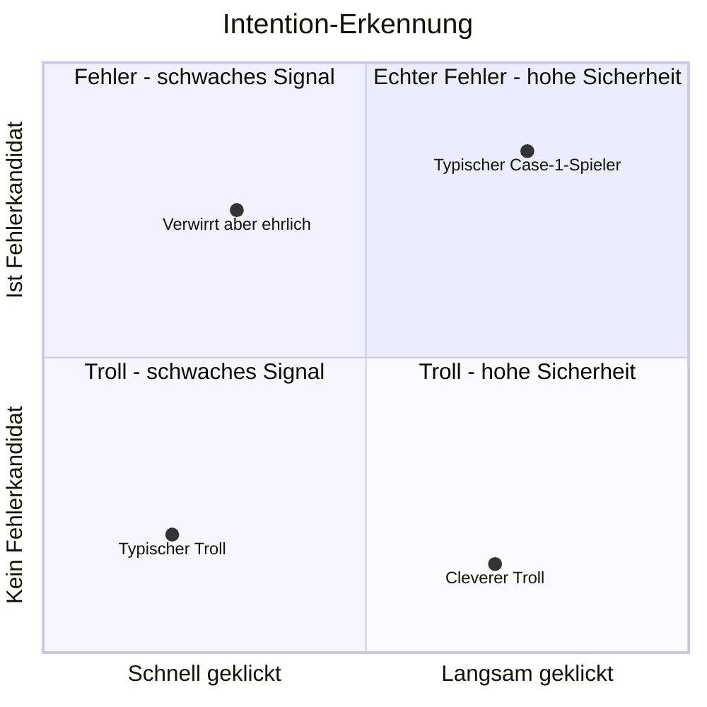
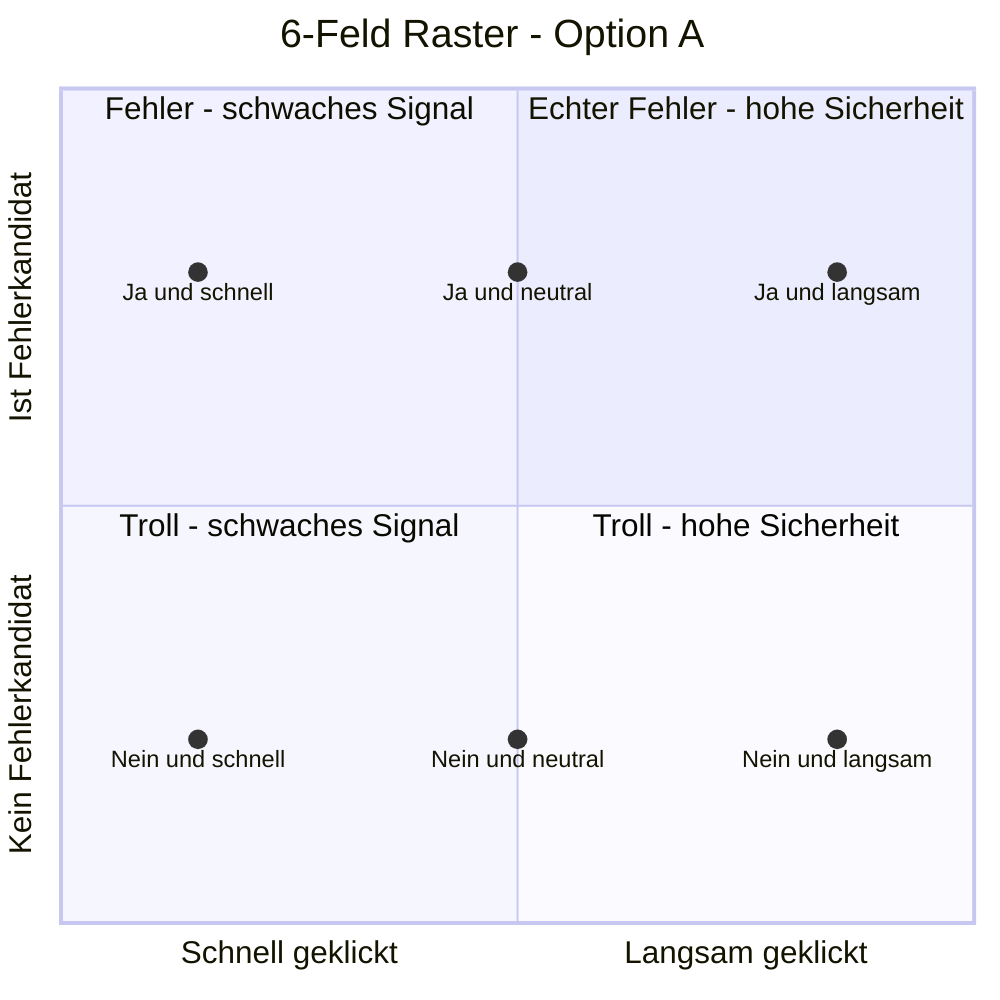
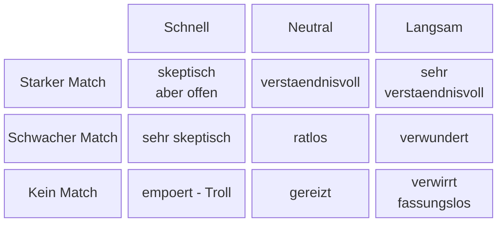

# ADR 0002: Erkennung der User-Intention bei "Das war nicht meine Karte"

**Datum:** 2026-03-13
**Status:** Draft – noch nicht entschieden

## Kontext

Am Ende des Tricks zeigt der Magier die identifizierte Karte. Wir wollen den User fragen:
*"War das Ihre Karte?"* mit den Antworten Ja / Nein.

Ein "Nein" kann zwei grundlegend verschiedene Ursachen haben:

1. **Echter Fehler (Case 1):** Der User war mit dem Spielablauf überfordert und hat in
   mindestens einer Runde versehentlich den falschen Stapel angeklickt. Der Algorithmus
   hat daher eine andere Karte gefunden als die gemerkete.

2. **Absichtliches Testen (Case 2):** Der Algorithmus hat die richtige Karte gefunden,
   aber der User klickt "Nein" um das Spiel auf die Probe zu stellen oder aus Spaß.

## Motivation

Viel Spaß am Spiel entsteht durch Experimentieren und den Charakter des Magiers:
er gibt den großen Geheimnisvollen, ist aber gleichzeitig klein, rechthaberisch und
aufbrausend. Wenn wir Case 1 vs. Case 2 unterscheiden können, kann der Magier
unterschiedlich reagieren — z.B. ein Bild zeigen wie er aus der Haut fährt wenn er
getrollt wird. Das gibt dem Spiel Charakter und reizt den User, verschiedene
Spielausgänge zu provozieren (Replayability).

## Problem

Aus den reinen Spieldaten (3 Stapelwahlen + gefundene Karte) lassen sich diese beiden
Fälle **nicht direkt unterscheiden**, weil wir nie wissen, welche Karte der User
tatsächlich im Kopf hatte.

## Grundlage: Die 6 Fehlerkandidaten

Da der Algorithmus deterministisch ist, lässt sich für jede mögliche Falsch-Wahl
berechnen, welche Karte stattdessen gefunden worden wäre. Bei 3 Runden und je 2
alternativen Stapelwahlen ergeben sich immer genau 6 "Fehlerkandidaten":
3 Runden × 2 Alternativen = 6 alternative Spielverläufe, jeder mit genau 1 Ergebnis.

Jeder Kandidat ist die Antwort auf: *"Was hätte der Algorithmus gefunden, wenn der User
in genau einer Runde einen anderen Stapel gewählt hätte?"*

Die Fehlerkandidaten können erst **nach Abschluss aller 3 Runden** berechnet werden,
da dafür sowohl das initiale Deck als auch alle 3 tatsächlichen Wahlen des Users
bekannt sein müssen. Der Berechnungszeitpunkt ist also: unmittelbar nachdem der User
"Nein" geklickt hat.

**Konsequenz für das Model:** Das initiale Deck darf nicht weggeworfen werden.
Es reicht, folgendes im Model zu halten:

- Das ursprüngliche `ProperSizedDeck` (vor Runde 1)
- Die `List UserSelection` mit allen 3 Wahlen

Damit lässt sich jeder der 6 alternativen Spielverläufe vollständig rekonstruieren.
Die sauberere Alternative wäre, die 3 Zwischenergebnisse nach jedem `mergeGame`
zu speichern — das ist jedoch redundant, da sie aus den obigen zwei Werten
ableitbar sind.

### Konkretes Beispiel (9 Karten)

**Initiales Deck nach Shuffle:**
```
♥Q  ♥K  ♠8  ♦A  ♣3  ♥7  ♠2  ♦K  ♣9
 0    1    2    3    4    5    6    7    8
```

**Runde 1 — handOut (round-robin):**
```
Left   (0,3,6): ♥Q  ♦A  ♠2
Center (1,4,7): ♥K  ♣3  ♦K
Right  (2,5,8): ♠8  ♥7  ♣9
```
User wählt **Left** → merge: Center ++ **Left** ++ Right
```
♥K ♣3 ♦K | ♥Q ♦A ♠2 | ♠8 ♥7 ♣9
```

**Runde 2 — handOut:**
```
Left   (0,3,6): ♥K  ♥Q  ♠8
Center (1,4,7): ♣3  ♦A  ♥7
Right  (2,5,8): ♦K  ♠2  ♣9
```
User wählt **Center** → merge: Left ++ **Center** ++ Right
```
♥K ♥Q ♠8 | ♣3 ♦A ♥7 | ♦K ♠2 ♣9
```

**Runde 3 — handOut:**
```
Left   (0,3,6): ♥K  ♣3  ♦K
Center (1,4,7): ♥Q  ♦A  ♠2
Right  (2,5,8): ♠8  ♥7  ♣9
```
User wählt **Center** → merge: Left ++ **Center** ++ Right
```
♥K ♣3 ♦K | ♥Q ♦A ♠2 | ♠8 ♥7 ♣9
            ^Index 4^
```
**readMind → ♦A** ✓

**Die 6 Fehlervarianten** — jeweils eine Wahl geändert, Rest identisch:

| Variante | Geändert   | R1     | R2     | R3     | readMind |
| ---      | ---        | ---    | ---    | ---    | ---      |
| Actual   | —          | Left   | Center | Center | **♦A**   |
| V1       | R1→Center  | Center | Center | Center | **♣3**   |
| V2       | R1→Right   | Right  | Center | Center | **♥7**   |
| V3       | R2→Left    | Left   | Left   | Center | **♥Q**   |
| V4       | R2→Right   | Left   | Right  | Center | **♠2**   |
| V5       | R3→Left    | Left   | Center | Left   | **♣3** ← Duplikat von V1 |
| V6       | R3→Right   | Left   | Center | Right  | **♥7** ← Duplikat von V2 |

**Befund:** V5 und V6 liefern dieselben Karten wie V1 und V2 — es gibt also nur
**4 eindeutige Fehlerkandidaten**: ♣3, ♥7, ♥Q, ♠2. "Bis zu 6" ist korrekt,
Duplikate sind möglich. Bei 9 Karten decken 4 Kandidaten bereits 50% der
verbleibenden Karten ab — das Signal ist schwach.

**Bekannte Schwäche — Aussagekraft abhängig von Deck-Größe:**
Die 6 Kandidaten bleiben immer 6, egal wie viele Karten im Deck. Der Lösungsraum
schrumpft aber mit dem Deck:

| Deck-Größe | Fehlerkandidaten | Verbleibende Karten | Abdeckung |
| ---        | ---              | ---                 | ---       |
| 21 Karten  | 6                | 20                  | 30%       |
| 9 Karten   | 6                | 8                   | 75%       |

Bei 21 Karten ist 30% Abdeckung noch ein brauchbares Signal. Bei kleinen Decks
wird der Ansatz fast wertlos. **Noch nicht abschließend bewertet.**

### Korrigierte Grundannahme: Echter Fehler erzeugt oft mehr als 1 Pfad-Abweichung

**Entdeckt durch Laufzeit-Tests (2026-03-15).**

Ursprüngliche Annahme war: *"Wenn der User in genau einer Runde den falschen Stapel wählt,
erscheint seine echte Karte als Fehlerkandidat."*

**Das stimmt nicht.**

Konkretes Gegenbeispiel aus einem echten Testlauf (21 Karten):

- User verfolgt ♣A
- R1: ♣A in Left → User klickt **Left** ✓
- R2: ♣A in Left → User klickt **Center** (bewusster Fehler)
- R3: ♣A liegt nach dem Fehler-Merge nun in Left → User klickt **Left** ✓
- Algorithmus findet S10. errorCandidates: [C6, S9, S4, C5, D10, D7] — **♣A nicht enthalten.**

**Warum fehlt ♣A?** Der Fehler in R2 verändert die Deck-Anordnung für R3. Der User
sieht ♣A dann in der *neuen (fehlerhaften)* Anordnung und wählt korrekt nach ihr. Der
ideale Pfad (ohne Fehler) hätte ♣A in R3 in einen *anderen* Stapel gelegt. Der tatsächliche
Pfad `[Left, Center, Left]` und der ideale Pfad `[Left, Left, Center]` weichen an
**zwei Stellen** ab — obwohl der User nur *einen* bewussten Fehler gemacht hat.

Die 6 Fehlerkandidaten prüfen: *"Was passiert wenn genau eine der 3 tatsächlichen
Wahlen geändert wird?"* — das ist **nicht äquivalent** zu *"Was hätte der korrekte
Pfad ergeben?"*

**Revidierte Signalinterpretation:**

| Situation | Bisherige Deutung | Korrigierte Deutung |
|---|---|---|
| Genannte Karte ist Kandidat | Echter Fehler (sicher) | Konsistent mit echtem Fehler — positives Signal |
| Genannte Karte ist kein Kandidat | Troll-Verdacht | **Ambivalent** — echter Fehler mit adaptiertem Tracking ist ebenso möglich |

Das Signal ist **asymmetrisch**: Kandidat ist ein starkes positives Signal für echten Fehler.
Kein Kandidat ist kein starkes Signal in irgendeine Richtung — es umfasst echte
Einzel-Fehler, Mehr-Runden-Fehler und Trolling gleichzeitig.

**Konsequenz für die Magier-Reaktion:** Der "Kein Kandidat"-Fall darf nicht mehr
automatisch als Troll-Verdacht behandelt werden. Das Timing-Signal wird damit zum
**primären Disambiguator** für diesen Fall — nicht mehr zum sekundären Verstärker.

## Analysierte UX-Varianten nach einem "Nein"

### Variante A: Alle 21 Karten zur Auswahl zeigen

Der User wählt seine Karte aus dem gesamten Deck.

- Wählt er eine der 6 Fehlerkandidaten → **Case 1**
- Wählt er eine andere Karte → **Case 2**

**Problem:** Zu unübersichtlich, vor allem auf kleinen Bildschirmen.

### Variante B: Die 6 Kandidaten direkt zeigen

*"Ist Ihre Karte darunter?"* — User sieht nur die 6 möglichen Fehlerkarten.

- Klickt er eine davon → **Case 1**
- Klickt er "Nein" → **Case 2**

**Problem:** Ein Troll klickt einfach nochmal "Nein". Wir wissen wieder nichts.
Außerdem könnte das Zeigen der 6 Karten den Mechanismus zu sehr enthüllen.

### Variante C: Zweistufige Auswahl (Farbe → Wert)

Erst Farbe wählen (♠ ♥ ♦ ♣ = 4 Buttons), dann Kartenwert (A 2 … K = 13 Buttons).
Maximal 2 Klicks, definitive Antwort.

- Genannte Karte ist ein Fehlerkandidat → **Case 1**
- Genannte Karte ist kein Fehlerkandidat → **Case 2**

**Nachteil:** 2 Interaktionsschritte, fühlt sich etwas nach Verhör an.

### Variante D: Nur die Farbe fragen (probabilistisch)

4 Buttons (♠ ♥ ♦ ♣). Minimale Reibung. Kein definitives Ergebnis, aber ein
Wahrscheinlichkeitssignal basierend auf der Farbverteilung unter den 6 Kandidaten.

Beispiel: Kandidaten sind 3× ♥, 2× ♠, 1× ♦, 0× ♣.
- User sagt ♥ → hohes Vertrauen in Case 1 (3 von 6 passen)
- User sagt ♣ → kein Kandidat passt → sehr wahrscheinlich Case 2

**Vorteil:** Der Magier kann mit abgestufter Sicherheit reagieren —
*"Ah, très intéressant..."* bei hoher Wahrscheinlichkeit vs.
*"Vous me mentez!"* bei sehr unwahrscheinlicher Farbangabe.

**Schwäche:** Wenn die 6 Kandidaten alle 4 Farben gleichmäßig abdecken, ist das
Signal schwach. Die Qualität des Signals variiert je nach konkretem Spielverlauf.

**Idee: Gezinktes Spiel durch Seed-Manipulation**

Wenn wir den Zufalls-Seed so wählen würden, dass die Farbverteilung der 6 Kandidaten
möglichst ungleich ist, wäre Variante D immer aussagekräftig. Diese Idee scheitert
jedoch an zwei Problemen:

1. Die Farbverteilung der 6 Kandidaten hängt nicht nur vom initialen Shuffle ab,
   sondern auch von den 3 tatsächlichen Wahlen des Users. Ein "guter" Seed für
   die Wahlen [Left, Center, Right] kann bei [Right, Right, Left] eine gleichmäßige
   Verteilung ergeben. Um alle 27 möglichen Wahlkombinationen (3³) abzudecken,
   bräuchte man einen Seed der für *jede* Kombination eine schiefe Verteilung
   garantiert — das ist kaum erreichbar.

2. Würde man auf eine kleine Menge "guter" Seeds einschränken, würde ein User der
   mehrfach spielt sehr schnell denselben Kartenverlauf wiedersehen. Das fällt auf.

**Konsequenz:** Der Seed bleibt vollständig zufällig. Stattdessen wird die
**Reaktion des Magiers** an die tatsächliche Signalstärke des jeweiligen Spielverlaufs
angepasst:

- Farbverteilung der 6 Kandidaten ist schief → Farbangabe des Users ist aussagekräftig
  → Magier reagiert mit hoher Sicherheit (empört oder verständnisvoll)
- Farbverteilung ist gleichmäßig → Signal schwach → Magier reagiert mit
  gespielter Ungewissheit oder Skepsis

Die Manipulation betrifft also nicht die Nachfrage, sondern die **Intensität der
Magier-Reaktion**.

## Weitere Ansätze

### Timing-Daten bei Stapelwahl

Die Zeit zwischen Anzeige der Stapel und Klick des Users wird pro Runde gemessen.
Sehr schnelle Klicks (<500ms) deuten auf Unachtsamkeit oder Trolling hin;
längere Überlegezeiten (2–3s) sprechen für echtes Mitspielen.

**Konkretes Implementierungskonzept:**

Der Zeitstempel wird in zwei Momenten erfasst:

1. **Wenn die Stapel sichtbar werden** (d.h. wenn der App-Zustand nach `ShowingStacks`
   wechselt): `Task.perform StackShownAt Time.now` → speichert `Time.Posix` im Model.

2. **Wenn der User einen Stapel klickt**: `Task.perform (StackClickedAt selection) Time.now`
   → speichert Klick-Zeitstempel und berechnet die Differenz.

**Model-Erweiterung:**

```elm
type alias RoundTiming =
    { shownAt : Time.Posix
    , clickedAt : Time.Posix
    }

-- Im Model:
roundTimings : List RoundTiming   -- wächst pro Runde, max 3 Einträge
stackShownAt : Maybe Time.Posix   -- Zwischenspeicher bis zum Klick
```

Nach allen 3 Runden liegt eine `List RoundTiming` mit 3 Einträgen vor.
Die Differenz `clickedAt - shownAt` ergibt die Reaktionszeit pro Runde in Millisekunden.

**Auswertungslogik (Heuristik):**

```
scoreRound : RoundTiming -> Int
scoreRound t =
    let ms = Time.posixToMillis t.clickedAt - Time.posixToMillis t.shownAt
    in
    if ms < 500 then -1      -- verdächtig schnell (Troll oder unachtsam)
    else if ms > 5000 then 1  -- echte Überlegung
    else 0                    -- neutral

timingScore : List RoundTiming -> Int
timingScore = List.sum << List.map scoreRound
```

Ein `timingScore >= 2` ist ein starkes Signal für echtes Mitspielen (Case 1);
ein `timingScore <= -2` verstärkt den Troll-Verdacht (Case 2).

**Umsetzungsaufwand:** Gering. Keine neue Bibliothek nötig, `Time.now` via Task
ist Standard-Elm. Nur als ergänzende Heuristik nutzbar, nicht als alleiniges Signal.

## Kombination der beiden Signale

### Warum sie sich gegenseitig stärken

Die entscheidende Eigenschaft: die beiden Signale messen **verschiedene, weitgehend
unabhängige Dimensionen** desselben Verhaltens.

- **Fehlerkandidaten** = *Was* hat der User letztlich angegeben? (Output)
- **Timing** = *Wie* hat der User während des Spiels geklickt? (Prozess)

Das ist keine Redundanz, sondern Orthogonalität: Jemand der beim Timing "auffällig"
ist, muss nicht zwingend beim Kandidaten-Signal auffällig sein — und umgekehrt.
Damit liefert jeder Treffer neue Information, statt dasselbe nochmal zu messen.

### Warum das Timing schwer zu fälschen ist

Ein Troll der bewusst "Nein" klickt, hat beim Timing in der Regel **nicht aktiv
manipuliert** — er hat einfach schnell geklickt, weil ihm das Spiel egal ist.
Das Timing-Signal entsteht *während des Spiels*, bevor der User weiß dass es
ausgewertet wird. Es ist damit ein passives Verhaltensmuster, kein aktiver Einwand.

Ein echter Case-1-Spieler hingegen hat seine Karte im Kopf, überlegt vor jedem Klick
("ist das der richtige Stapel?") und klickt deshalb langsamer — ohne es zu wollen
oder zu wissen.

### Das Troll-Dilemma: Schwierig beide Signale gleichzeitig zu faken

Ein cleverer Troll könnte theoretisch beide Signale manipulieren:
- Absichtlich langsam klicken (timing faken)
- Danach gezielt eine der 6 Fehlerkandidaten-Karten nennen (output faken)

Das setzt aber voraus, dass er den Algorithmus kennt *und* aktiv plant.
Für den Durchschnittsnutzer der einfach "Nein" trollt, ist das unrealistisch.

### Kombinationsmatrix

Die vier Quadranten visualisiert — X-Achse: Klickgeschwindigkeit, Y-Achse: Fehlerkandidat:



**Lesehinweis (revidiert nach Laufzeit-Tests):**

- **Oben-rechts** (Kandidat ✓ + langsam): Stärkste Kombination für echten Fehler.
  Magier reagiert verständnisvoll: *"Je comprends, mon ami — das kann passieren."*

- **Oben-links** (Kandidat ✓ + schnell): Kandidat positiv, aber Schnelligkeit etwas
  suspicious. Magier reagiert konziliant mit leichtem Zweifel: *"Hmm... möglich."*

- **Unten-rechts** (kein Kandidat + langsam): **Ambivalent.** Könnte echter Fehler mit
  adaptiertem Tracking sein (der User hat nach dem ersten Fehler die neue Deck-Anordnung
  korrekt weiterverfolgt — seine Karte wäre durch eine 2-Positions-Änderung erreichbar,
  die errorCandidates nicht abdeckt). Könnte aber auch ein aufmerksamer Troll sein.
  Magier reagiert nachdenklich-rätselhaft, **keine Anklage**:
  *"Das ist... inexplicable. Ich bin verwirrt, aber ich zweifle nicht an Ihnen."*

- **Unten-links** (kein Kandidat + schnell): Stärkster Troll-Indikator. Schnelles Klicken
  schließt das "adaptiertes Tracking"-Szenario weitgehend aus — wer seine Karte wirklich
  verfolgt, klickt nicht in unter 500ms. Magier reagiert empört:
  *"Vous me mentez! Sie schummeln!"*

Die **Beispielpunkte** zeigen typische Nutzerprofile:

- *Typischer Case-1-Spieler*: Hat wirklich überlegt (langsam) und nennt eine Fehlerkandidaten-Karte
- *Verwirrt aber ehrlich*: Hat etwas gehetzt geklickt, aber die Karte passt zu einem Fehlerkandidat
- *Cleverer Troll*: Hat sich Zeit gelassen um unverdächtig zu wirken, nennt aber keine Fehlerkarte
- *Typischer Troll*: Hat schnell geklickt und nennt eine beliebige Karte

Bei `timingScore == 0` (neutral, 500ms–5s) entscheidet allein der Fehlerkandidat-Befund,
aber die Magier-Reaktion fällt moderater aus als in den Extremfällen.

### Warum das Signal nie perfekt sein kann — und das in Ordnung ist

Selbst mit beiden Signalen gibt es keine 100%-Sicherheit. Das ist kein Bug,
sondern ein Feature: Ein Magier der manchmal irrt ist glaubwürdiger als einer
der immer recht hat. Die Unsicherheit gehört zum Charakter.

Das Ziel ist nicht Klassifikationsgenauigkeit, sondern eine Reaktion die im
Kontext *plausibel* wirkt und Replayability erzeugt — beide Signale zusammen
reichen dafür aus.

### Sitzungshistorie

Wer in mehreren Spielen hintereinander "Nein" klickt, ist mit hoher
Wahrscheinlichkeit ein Troll. Erfordert Persistenz (localStorage oder Backend) —
aktuell nicht im Scope.

## Erweiterung: 6-Feld und 9-Feld Raster

Das 4-Quadranten-Modell vereinfacht den timingScore auf "schnell vs. langsam" und
ignoriert die natürliche Neutral-Zone. Beide Signale haben jedoch eine sinnvolle
dritte Stufe — was zu verfeinerten Rastern führt.

### Option A: 6-Feld Raster (Variante C + Timing, 2x3)

Fehlerkandidat bleibt binär (Ja/Nein). Der timingScore wird in 3 Stufen aufgeteilt:
schnell (<500ms), neutral (500ms–5s), langsam (>5s). Ergibt 2×3 = 6 Felder.

Die Punkte im Diagramm repräsentieren die sechs Zonen — je eine pro Feld:



Die senkrechte Mittellinie des Diagramms bei x=0.5 trennt schnell/langsam —
die neutrale Zone liegt auf dieser Linie und ist der Mehrwert gegenüber 4 Quadranten.

| Feld | Bedingung | Magier-Reaktion |
|---|---|---|
| 1 | Fehlerkandidat + Schnell | Konziliant mit Vorbehalt: "Ich glaube Ihnen... vielleicht" |
| 2 | Fehlerkandidat + Neutral | Verstaendnisvoll, hilfsbereit |
| 3 | Fehlerkandidat + Langsam | Sehr verstaendnisvoll, fast entschuldigend |
| 4 | Kein Kandidat + Schnell | Empoert: "Vous me mentez!" — staerkster Troll-Indikator |
| 5 | Kein Kandidat + Neutral | Nachdenklich-raetselhaft, keine Anklage (ambivalent) |
| 6 | Kein Kandidat + Langsam | Verwirrt-gruebelnd: echtes Fehler-mit-Tracking ebenso moeglich wie Troll |

**Hinweis zu Feldern 4–6:** Die Felder "Kein Kandidat" sind seit der Korrektur der
Grundannahme alle ambivalenter zu interpretieren. Nur Feld 4 (kein Kandidat + schnell)
bleibt ein starkes Troll-Signal, weil schnelles Klicken das "adaptiertes Tracking"-Szenario
ausschließt. Felder 5 und 6 sollten keine klare Anklage erzeugen.

**Benoetigt: 6 Reaktionsbilder des Magiers**

### Option B: 9-Feld Raster (Variante D + Timing, 3x3)

Voraussetzung: Variante D (User nennt nur die Farbe). Das Fehlerkandidat-Signal
wird probabilistisch auf 3 Stufen aufgeteilt je nachdem wie viele der 6 Kandidaten
die genannte Farbe haben:

- **Starker Match**: 3–6 Kandidaten haben diese Farbe
- **Schwacher Match**: 1–2 Kandidaten haben diese Farbe
- **Kein Match**: 0 Kandidaten haben diese Farbe



| | Schnell | Neutral | Langsam |
|---|---|---|---|
| **Starker Match** | Skeptisch: "Haben Sie sich beeilt?" | Verstaendnisvoll | Sehr verstaendnisvoll |
| **Schwacher Match** | Sehr skeptisch: "Zufall!" | Ratlos, unsicher | Leicht verwundert |
| **Kein Match** | "Sie luegen mich an!" | Gereizt | "Das ist inexplicable..." |

**Benoetigt: 9 Reaktionsbilder** (einige ahnliche Felder konnten ein Bild teilen, minimal ~7)

---

### Weiterentwicklung: Kontinuierliche Diskriminierung statt Raster-Buckets

*(Noch nicht umgesetzt — Design-Entscheidung für die Implementierung)*

Das 3×3-Raster ist eine grobe Diskretisierung eines eigentlich **kontinuierlichen
2D-Raums**. Die beiden Rohsignale haben natürliche kontinuierliche Ausprägungen:

- `suitMatchCount` : Int — 0 bis 6 (wie viele der 6 Kandidaten haben die genannte Farbe)
- `totalReactionMs` : Int — Summe der 3 Runden-Reaktionszeiten in Millisekunden

Wenn man diese Werte als X- und Y-Achse aufträgt, entsteht ein 2D-Raum mit einem
natürlichen **diagonalen Farbverlauf**: unten-links (kein Match + schnell) = starker
Troll-Verdacht, oben-rechts (starker Match + langsam) = hohe Wahrscheinlichkeit für
echten Fehler.

```
hoher Match  |         ░░▒▒▓▓██
             |       ░░▒▒▓▓██
             |     ░░▒▒▓▓██
             |   ░░▒▒▓▓██
             | ░░▒▒▓▓██
kein Match   |▒▒▓▓██
             +-------------------
             schnell          langsam
```

**Warum Raster-Buckets die falsche Abstraktion sind:**
Achsenparallele Grenzen (wie im 3×3-Raster) bedeuten: "ab 3 Kandidaten gilt es als
starker Match, egal wie schnell geklickt wurde." Das stimmt nicht mit der
Gradient-Intuition überein. Eine diagonale Diskriminierungslinie drückt aus: ein
schwacher Match bei sehr langsamem Klicken kann genauso überzeugend sein wie ein
starker Match bei mittlerem Tempo.

**Implementierungsidee: Linearer Score + konfigurierbare Schwellwerte**

Statt Enums früh zu erzeugen, wird ein skalarer Score berechnet:

```
score = w_suit * suitMatchCount + w_timing * (totalReactionMs / 1000.0)
```

Zwei Schwellwerte `t1 < t2` teilen den Score-Bereich in 3 Zonen, die auf 3–4
Reaktionen gemappt werden. Die Gewichte `w_suit`, `w_timing` und die Schwellwerte
`t1`, `t2` sind **keine Compile-Zeit-Konstanten**, sondern konfigurierbare Parameter.

**Warum Konfigurierbarkeit wichtig ist:**
Die richtigen Werte für Gewichte und Schwellwerte sind empirisch — sie hängen davon
ab wie echte User spielen. Das lässt sich nicht im Voraus korrekt schätzen. Eine
Konfigurationsdatei (z.B. JSON in `public/`) erlaubt es, diese Parameter nach
Erfahrung nachzujustieren — ohne Neukompilierung und ohne Testdurchläufe.
Ein Deploy der geänderten JSON-Datei genügt.

Elm-seitig könnten die Parameter über `Flags` beim App-Start eingelesen werden:

```elm
type alias ReactionConfig =
    { suitWeight    : Float
    , timingWeight  : Float
    , threshold1    : Float   -- Grenze zwischen Reaktion A und B
    , threshold2    : Float   -- Grenze zwischen Reaktion B und C
    }
```

```js
// index.js
fetch('/reaction-config.json')
    .then(r => r.json())
    .then(config => Elm.Main.init({ flags: config }));
```

**Konsequenz für die Reaktionsbilder:**
Statt 9 Felder auf 9 Bilder zu mappen, werden 3–4 Reaktionen definiert die auf einem
Spektrum von "verständnisvoll" bis "empört" liegen. Die Diskriminierungslinien
bestimmen dann zur Laufzeit welche Reaktion ausgelöst wird. Das reduziert den
Bilderbedarf ohne die Nuancierung zu verlieren.

---

## Entscheidungshilfe: Welches Raster wahlen?

### Gesamtbedarf an Magier-Bildern

Neben den Reaktionsbildern braucht der Magier Bilder fur den normalen Spielverlauf:

| Phase | Anzahl | Beschreibung |
|---|---|---|
| Intro / Beschwörung | 1–2 | Magier tritt auf, geheimnisvoll |
| Runde 1 austeilen | 1 | Konzentrierter Blick |
| Runde 2 austeilen | 1 | Zuversichtlich |
| Runde 3 austeilen | 1 | Dramatisch |
| Enthüllung (Treffer) | 1 | Triumphierend |
| **Spielphasen-Subtotal** | **5–6** | |

Gesamtbedarf inklusive Reaktionsbilder:

| Raster | Reaktionsbilder | Gesamtbilder | Trennscharf generierbar? |
|---|---|---|---|
| 4 Quadranten | 4 | ~9–10 | Ja — 4 klare Grundemotionen |
| 6-Feld (Option A) | 6 | ~11–12 | Ja — praktische Obergrenze |
| **9-Feld (Option B)** | **9 (~7)** | **~14–15** | **Bedingt — aber Felder jetzt besser begruendet** |

**Warum 6 die praktische Grenze war:** GPT Image kann einen Charakter konsistent
halten, aber subtile Abstufungen ("leicht gereizt" vs. "mittel gereizt") werden
bildlich kaum unterscheidbar. Grundemotionen (Freude, Empörung, Verwirrtheit,
Skepsis) plus je eine abgestufte Variante davon ergeben 6 Bilder die sich
voneinander klar abgrenzen. Darüber wird es unzuverlässig.

**Revision (2026-03-15):** Die 9 Felder des 3×3-Rasters haben nach der Korrektur
der Grundannahme eine klarere semantische Trennung als zuvor angenommen — insbesondere
die mittlere Zeile (Schwacher Match) hat jetzt eine eigenständige Bedeutung und ist
kein Randfall mehr. Das verringert das Risiko visuell zu ähnlicher Bilder, weil die
Situationen emotional weniger nah beieinander liegen.

### Vergleich der Optionen

| Kriterium | 4 Quadranten | 6-Feld (Option A) | 9-Feld (Option B) |
|---|---|---|---|
| UX fur User | exakte Karte nennen | exakte Karte nennen | nur Farbe nennen |
| Algorithmus-Aufwand | gering | gering (+neutral case) | mittel (Farbverteilung) |
| Neue Elm-Typen | keine | keine | `SuitMatchStrength` |
| Reaktionsbilder | 4 | 6 | 9 (~7) |
| Gesamtbilder | ~9 | ~11 | ~14 |
| Robustheit gegen adaptives Tracking | schwach | schwach | **gut** |
| Charakter-Reichtum | mittel | gut | am reichsten |

**Neu hinzugefügtes Kriterium "Robustheit gegen adaptives Tracking":**
Variante C (exakte Karte) verliert echte Fehler mit adaptivem Tracking komplett —
sie fallen in den "Kein Match"-Bucket und werden als ambivalent behandelt.
Variante D (Farbe) fängt viele dieser Fälle als "Schwacher Match" auf, weil die
Farbe der echten Karte mit höherer Wahrscheinlichkeit unter den 6 Kandidaten
vertreten ist als die exakte Karte selbst.

### Empfehlung

**Revidiert: 9-Feld mit Variante D** ist der bessere Kompromiss wenn Signalqualität
Vorrang hat:

- Variante D ist robuster gegen den strukturellen Fehlklassifizierer den die
  Korrektur der Grundannahme aufgedeckt hat (adaptives Tracking)
- Die mittlere Zeile "Schwacher Match" hat jetzt eine klar benennbare Bedeutung
  statt nur ein Puffer zu sein — das erleichtert die Bild-Generierung
- Der Mehraufwand (SuitMatchStrength-Typ, Farbverteilungsberechnung) ist gering
- UX-seitig ist Variante D sogar einfacher (1 Klick auf Farbe statt 2 Klicks)

**6-Feld mit Variante C** bleibt vertretbar wenn man den Charakter des Magiers
priorisiert ("er weiss es genau, er muss nicht raten") und den Fehlklassifizierer
bewusst in Kauf nimmt. Der Charakter-Aspekt ist ein echtes Argument — ein Magier
der nach der *Farbe* fragt wirkt weniger allwissend.

## Empirische Validierung der suitMatchRatio (2026-03-15)

18 Testläufe wurden durchgeführt (5× Troll, 5× Fehler R1, 5× Fehler R2, 3× Fehler R3).
Pro Lauf wurde die verfolgte Karte protokolliert. Vollständige Rohdaten:
`doc/data-collection-result.txt`.

### Ergebnis: suitMatchRatio hat keine Trennkraft zwischen Troll und F1/F2

| Szenario | suitMatchRatio (Ø) | Wertebereich | Karte in Candidates |
|---|---|---|---|
| Troll (T) | 0.267 | 0.167 – 0.500 | 0 / 5 (0%) |
| Fehler R1 (F1) | 0.307 | 0.200 – 0.333 | 0 / 5 (0%) |
| Fehler R2 (F2) | 0.233 | 0.000 – 0.500 | 0 / 5 (0%) |
| Fehler R3 (F3) | 0.400 | 0.200 – 0.500 | **3 / 3 (100%)** |

Die Wertebereiche von T, F1 und F2 überlappen vollständig. Ein Troll mit Ratio 0.5 ist
datentechnisch nicht von einem F1-Fehler mit Ratio 0.5 zu unterscheiden. `suitMatchRatio`
allein ist damit **kein brauchbarer Diskriminator** für die praktisch relevante Frage
(Troll vs. echter Fehler in R1/R2).

### Ausnahme: F3 liefert ein starkes binäres Signal

Fehler in Runde 3 haben kein adaptives Tracking (nach der letzten Runde gibt es keine
weitere Anpassung). Die echte Karte erscheint daher **immer** in den Candidates — was
das theoretische Ergebnis aus den ScenarioAnalysisTests bestätigt. Dieses Signal ist
binär und 100% zuverlässig, aber auf den Sonderfall R3-Fehler beschränkt.

### Konsequenz für die Implementierung

- `suitMatchRatio` als primärer Entscheidungsknopf: **nicht sinnvoll**
- `errorCandidates` zurückbauen: **nicht nötig** — die Funktionen sind fertig und
  der F3-Bonus-Indikator ("Karte in Candidates?") liefert echten Mehrwert
- **Reaktionszeit bleibt das einzige Signal** das Troll von F1/F2-Fehler trennt
- Empfohlene Gewichtung im Score-Modell: `w_timing` deutlich höher als `w_suit`

---

## Empfehlung (noch offen)

Noch keine endgültige Entscheidung. Engste Kandidaten nach Revision:

- **9-Feld + Variante D** — bessere Signalrobustheit, klarere Bucket-Semantik,
  einfachere UX; Kosten: ~14 Bilder, SuitMatchStrength-Typ
- **6-Feld + Variante C** — stärkerer Charakter-Eindruck des Magiers, weniger
  Bilder; Kosten: struktureller Fehlklassifizierer bei adaptivem Tracking

**Offene Abwägungsfrage:** Ist der Charakter-Verlust ("Magier fragt nur nach Farbe")
schlimmer als der Fehlklassifizierer ("echter Fehler wird als ambivalent behandelt")?
Das ist eine UX-Entscheidung, keine algorithmische.

## Konsequenzen (wenn umgesetzt)

- Neue Funktion `errorCandidates : List UserSelection -> ProperSizedDeck -> List Card`
  in `MagicTrick.elm`
- Neuer AppPhase-Zustand: `AskingVerification` (nach "Nein"-Klick)
- Neue UI abhängig von gewählter Variante
- Neue Reaktionstexte und Bilder des Magiers für Case 1 und Case 2
